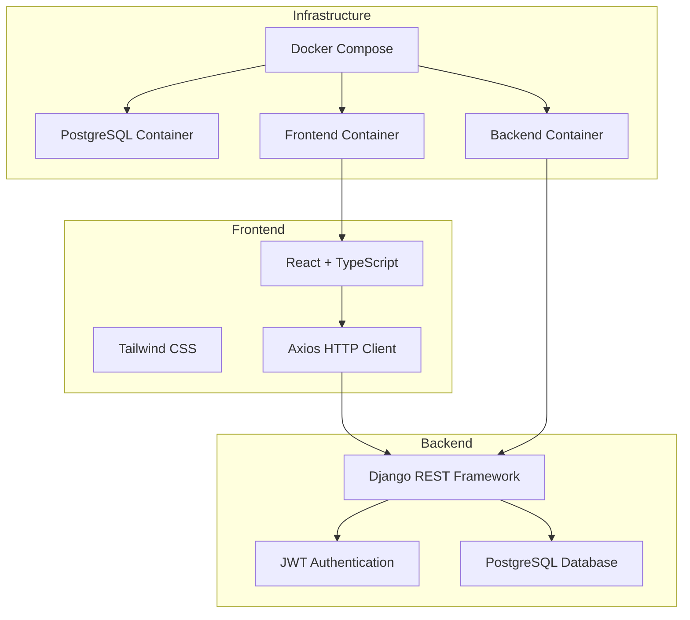
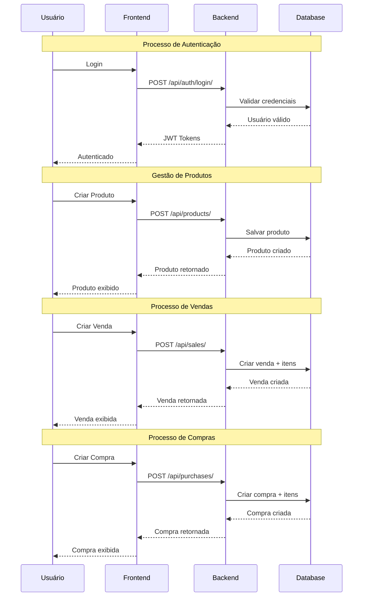
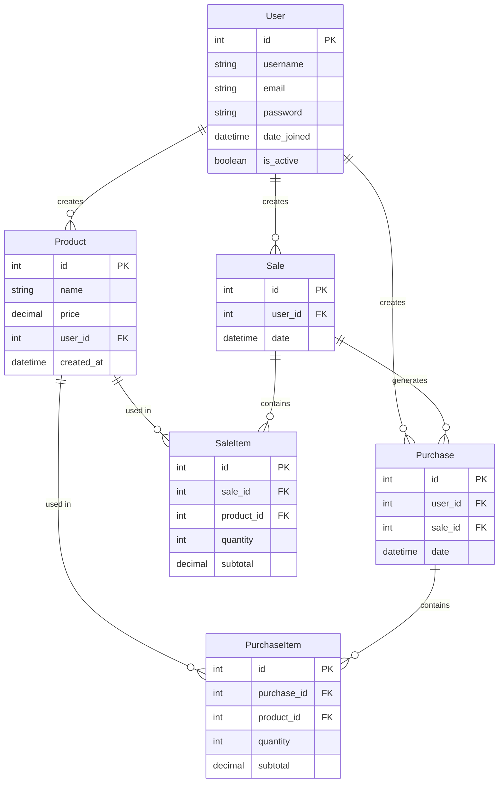

# Hubbi - Sistema de Gestão de Vendas e Compras

Sistema full-stack para gestão de vendas e compras. Desenvolvido com Django REST Framework no backend e React com TypeScript no frontend.


1. Clone o repositório
2. Configure o arquivo `.env`
3. Execute: `docker-compose up -d`

## Arquitetura do Sistema



## Fluxo de Dados



## Diagrama do Banco de Dados



## Variáveis de Ambiente

Crie um arquivo `.env` na raiz do projeto com as seguintes variáveis:

```bash
# Django Settings
SECRET_KEY=your-secret-key-here
DEBUG=True
ALLOWED_HOSTS=localhost,127.0.0.1

# Database Configuration
DB_NAME=your_database_name
DB_USER=your_database_user
DB_PASSWORD=your_database_password
DB_HOST=db
DB_PORT=5432

# CORS Configuration
CORS_ALLOWED_ORIGINS=http://localhost:3000,http://127.0.0.1:3000
```

## Backend

### Tecnologias
- Django 5.2.3
- Django REST Framework 3.16.0
- PostgreSQL 15
- JWT Authentication
- Docker

### Estrutura do Projeto
```
backend/
├── core/                 # Configurações centrais
│   ├── settings.py       # Configurações Django
│   ├── urls.py          # Roteamento principal
│   ├── auth_views.py    # Autenticação JWT
│   ├── services.py      # Serviços compartilhados
│   └── mixins.py        # Mixins reutilizáveis
├── products/            # App de produtos
├── sales/              # App de vendas
├── purchases/          # App de compras
├── requirements.txt    # Dependências Python
└── Dockerfile         # Container do backend
```

### Instalação Local

1. **Criar ambiente virtual:**
```bash
cd backend
python -m venv venv
source venv/bin/activate  # Linux/Mac
# ou
venv\Scripts\activate     # Windows
```

2. **Instalar dependências:**
```bash
pip install -r requirements.txt
```

3. **Configurar banco de dados:**
```bash
python manage.py migrate
```

4. **Criar superusuário:**
```bash
python manage.py createsuperuser
```

5. **Executar servidor:**
```bash
python manage.py runserver
```

### Endpoints Principais

- **Autenticação:** `/api/auth/login/`
- **Produtos:** `/api/products/`
- **Vendas:** `/api/sales/`
- **Compras:** `/api/purchases/`

## Frontend

### Tecnologias
- React 18
- TypeScript
- Tailwind CSS
- Axios
- React Router DOM
- Radix UI

### Estrutura do Projeto
```
frontend/
├── src/
│   ├── features/        # Funcionalidades por domínio
│   │   ├── auth/        # Autenticação
│   │   ├── products/    # Produtos
│   │   ├── sales/       # Vendas
│   │   └── purchases/   # Compras
│   ├── shared/         # Componentes compartilhados
│   │   ├── components/  # Componentes UI
│   │   ├── services/    # Serviços HTTP
│   │   └── hooks/       # Hooks customizados
│   └── routes/         # Roteamento
├── package.json        # Dependências Node.js
└── Dockerfile         # Container do frontend
```

### Instalação Local

1. **Instalar dependências:**
```bash
cd frontend
npm install
```

2. **Executar em desenvolvimento:**
```bash
npm run dev
```

3. **Build para produção:**
```bash
npm run build
```

## Deploy

### Docker Compose

O projeto utiliza Docker Compose para orquestração dos serviços:

```bash
# Executar todos os serviços
docker-compose up -d

# Ver logs
docker-compose logs -f

# Parar serviços
docker-compose down
```

### Serviços

- **PostgreSQL:** Porta 5432
- **Backend:** Porta 8000
- **Frontend:** Porta 3000

## Acesso ao Sistema

Após executar `docker-compose up -d`, acesse:

- **Frontend:** http://localhost:3000
- **Backend API:** http://localhost:8000/api/
- **Admin Django:** http://localhost:8000/admin/

### Credenciais Padrão

- **Superusuário:** admin/admin (criado automaticamente)

## Comandos Úteis

```bash
# Rebuild containers
docker-compose up --build

# Executar comandos no backend
docker-compose exec backend python manage.py migrate

# Executar comandos no frontend
docker-compose exec frontend npm run build

# Acessar shell do backend
docker-compose exec backend bash

# Ver logs específicos
docker-compose logs backend
docker-compose logs frontend
docker-compose logs db

# Status dos containers
docker-compose ps

# Parar e remover volumes
docker-compose down -v
```


